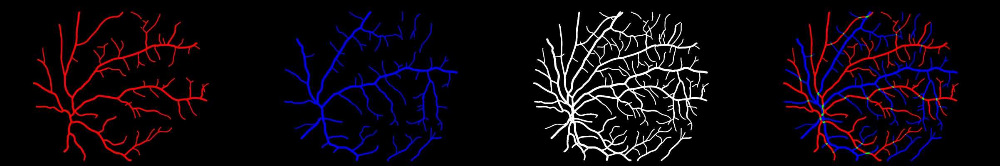

# AVRDB-AFIO Cleaned Artery/Vein Masks

*Example of refined A/V masks visualization (red: artery, blue: vein, green: crossing).*

### 📋 Overview

This repository provides **ready-to-use artery/vein segmentation masks** derived from the publicly available **AVRDB dataset**
(*AVRDB: Annotated dataset for vessel segmentation and calculation of arteriovenous ratio*).
The annotations were originally provided by the **Armed Forces Institute of Ophthalmology (AFIO)**.

The original masks contained non-binary pixel values and near-white or near-red artifacts, which caused difficulties in segmentation training.
I refined and remapped the masks using the following color convention:

| Label      | RGB Color   |
| ---------- | ----------- |
| Artery     | (255, 0, 0) |
| Vein       | (0, 0, 255) |
| Crossing   | (0, 255, 0) |
| Background | (0, 0, 0)   |

---

### 📁 Contents

* `/images`: RGB images
* `/av-labels`: processed artery/vein masks
* `samples/`: sample examples for illustration

---

### ⭐ Support the Project

If you find this repository useful, please consider giving it a star ⭐ on GitHub! Your support helps motivate further improvements and sharing with the community.

---

### 📖 Citation

#### Original Dataset

> Akbar, S., Hassan, T., Akram, M. U., Yasin, U. U., & Basit, I. (2017). AVRDB: Annotated Dataset for Vessel Segmentation and Calculation of Arteriovenous Ratio. In Proceedings of the International Conference on Imaging, Signal Processing and Pattern Recognition (IPCV'17), pp. 129-134.

#### This Work

```bibtex
@misc{trungdoavrdb,
  author       = {Thanh Trung Do},
  title        = {Cleaned and Standardized Artery/Vein Masks for the AVRDB Dataset},
  year         = {2025},
  howpublished = {\url{https://github.com/trungdo1810/AVRDB-Artery-Vein-Segmentation-Dataset.git}},
  note         = {Processed masks derived from AVRDB for A/V segmentation research.}
}
```

---

### 📧 Contact

For questions or access to the processing scripts, please contact:
📧 **[[trungdo1810.fw@gmail.com](mailto:trungdo1810.fw@gmail.com)]**

---

### ⚠️ Ethical Note

This work aims to facilitate reproducible research in retinal artery/vein segmentation by providing cleaned derivative masks based on annotations from the publicly available AVRDB dataset. All original fundus images and annotations are owned by the authors of the AVRDB dataset (Shahzad Akbar et al., 2017) and the Armed Forces Institute of Ophthalmology (AFIO).